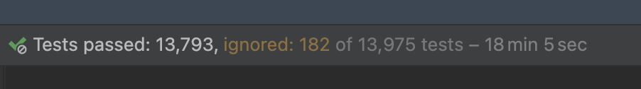

= Introduction

*Kotlite* is an open-sourced type-safe programming language that has a rich subset of the https://kotlinlang.org/[Kotlin] script language. It comes with standard libraries, which are a subset of Kotlin Multiplatform/Common standard libraries and a few third-party libraries.

*Kotlite Interpreter* is a lightweight Kotlin Multiplatform library to interpret and execute codes written in Kotlite, and bridge the host runtime environment and the embedded runtime environment.

https://github.com/sunny-chung/kotlite/[icon:github[] The Kotlite GitHub Repository]

== Major Features of Kotlite Interpreter

* Supports a subset of Kotlin 1.9 language and standard libraries. https://kotlinlang.org/[Kotlin] is a great, safe, descriptive and flexible language. Check the <<_language, differences between Kotlite and Kotlin>>.
* Supports writing complicated and generic code
* Embeddable -- it is a library
* Safe
** Classes from libraries or built-ins can be whitelisted or blacklisted
** Extension functions from libraries or built-ins can be whitelisted or blacklisted
** Extension properties from libraries or built-ins can be whitelisted or blacklisted
** Global properties from libraries or built-ins can be whitelisted or blacklisted
** No file or networking I/O or OS APIs in the standard library
* Runs in multiplatform
* Extensible and allows interaction with the host
** Allows providing custom extension functions from the host
** Allows providing custom extension properties from the host
** Allows providing custom global properties from the host
** Allows implementing custom libraries and delegating the calls to first-class Kotlin functions and properties
** Allows reading values of global variables in the embedded environment from the host
** Stdout pipe of the embedded environment is overridable
* Lightweight -- `kotlinc` is over 300 MB, and the sum of Kotlite with stdlib for all platforms is less than 10 MB. The JS script of the web demo is less than 800 KB.
* Semantic analysis, e.g. variable access and type verification, before execution
* Type inference
* Well tested -- there are more than a thousand of hand-written unit tests per platform
* Can be written in any IDE supporting Kotlin 1.9 -- Kotlite does not create new syntax

CAUTION: To be honest, the standard library is not well tested. Only the language itself is well tested. Please kindly help to report if any issue is found.

== Supported Platforms

- JVM (Java, Kotlin/JVM, ...)
- JS
- Android (JVM)
- iOS
- macOS
- watchOS
- tvOS

The interpreter does not depend on any platform-specific APIs except the built-ins, so it should be easy for an experienced developer to port the library to any other platform supported by Kotlin Multiplatform.

== Use Cases

Kotlite is designed for below use cases.

* Executing user-provided simple expressions in a safe way
* Executing user-provided script in a safe way
* Allowing custom plugins, written as Kotlin codes, for any Kotlin or JVM applications in a safe way
* Safely executing codes coming from servers
* Updating mobile app UI any time without app update submissions to app store (this requires the community to contribute)

== Non-goals

* Kotlite does not replace Kotlin
* Kotlite does not introduce new programming language features or syntax that are not provided in Kotlin, except necessaries supporting internal tools of Kotlite

== Side Products

* Rendering Kotlite codes as an AST (Abstract Syntax Tree) diagram using https://github.com/mermaid-js/mermaid[mermaid]
* Static analysis of Kotlite codes
* Generating AST nodes from Kotlite codes
* Reformatting Kotlite codes
